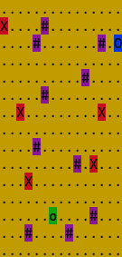

# ChaseGame

A game developed in Java where you run from artificial intelligence entities across a square field.

**Designations**:  
`o` - position of a player (program user) on the map.  
`#` - obstacle.  
`x` - enemy (artificial intelligence).  
`O` - target point the player must get to before the enemies reach the player. The player is considered to have reached the target cell if they stepped on its position.

**Game rules**:

1. Each participant (player and enemies) may make one move. Then, it's another participant's turn. The enemy is considered to have reached the player if it can step on the player's position by making the current move.
2. Available movement directions are left, right, downward, and upward.
3. If an enemy is unable to move forward (there are obstacles or other enemies around them, or a map edge has been reached), the enemy skips a move.
4. The target point is an obstacle for an enemy.
5. If the player is unable to move forward (surrounded by obstacles, enemies, or has reached an edge of the map), the player loses the game.
6. The player loses if an enemy finds them before they reach the target point.
7. The player starts the game first.

Game architecture:

1. The project was developed in Java using Maven.

2. Field size, number of obstacles, number of enemies and game mode are entered into the program using command-line parameters.

3. Enemies, obstacles, the player, and the target point are positioned on the field randomly.

4. To make a move, the player shall enter a number in the console that corresponds to the movement direction A, W, D, S (left, upward, right, downward).

5. If the player understands in the beginning or middle of the game that the target point is unreachable, they shall end the game by entering 9 (player loses).

6. Once the player has made a move, it is its enemy's turn to make a move towards the player.

7. In the development mode, each enemy's step shall be confirmed by the player by entering 8.

## Installation and launch

To install the game execute the command in ChaseGame root folder:

`mvn clean package`

To launch the game execute the command in ChaseGame root folder:

`java -jar target/game-jar-with-dependencies.jar --enemiesCount=4 --size=10 --wallsCount=8 --profile=production`
